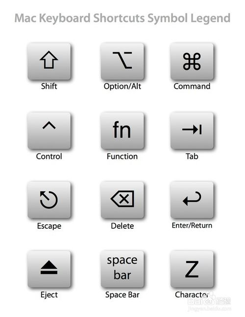

### Goland 初始化设置

- 将 tab 改为 4 个空格：Editor -》 code style -〉Go -》"tabs and indents", "use tab character" 之前的勾选去掉
- import： Editor -》 code style -〉Go -> "Imports"，貌似不需要改动，待验证。
- 修改字符集：Editor -》File encoding，修改为utf-8。（mac下默认已经是utf-8）

## 快捷键

### macos

> 小知识：Mac快捷键的图形符号
>
> Mac中主要有四个修饰键，分别是Command，Control，Option和Shift。

macos的快捷键

- [macOS 效率系列 04: 快捷键是所有人的必修课](https://justinyan.me/post/3776)
- 

## 最终定义的快捷键

### 调整windows键盘的键位

在 系统偏好设置 -》键盘 -〉修饰键中修改，将win设置为option，alt设置为command

### macos快捷键

macos快捷键：

- 显示桌面：f11
- macos切换workspace：ctrl + option + left/right （macos 10.15.2下是 ctrl + left/right）
- 调度中心：ctrl + option + up （macos 10.15.2下是 ctrl + up）
- 应用程序窗口：ctrl + option + down   （macos 10.15.2下是 ctrl + down）
- 切换输入法：ctrl +  空格键
- 截屏（直接截取当前屏幕全屏）： shift + command + 3
- 截屏（截取部分屏幕并容许修改区域）： shift + command + 5
- 截屏（自由选择截图的区域）： shift + command + a
- 显示聚焦搜索：command + 空格键

### goland快捷键

- 移动到花括号的开始和结束：command + `[`/`]`
- 删除一行代码：command + Y
- 复制一行代码：command + D
- 注释当前行： alt + /
- **Back / Forward： option + command + left/right**
- 搜索：command + N / shift + command + N / 双击shift
- 最近文件： command + E

go相关：

- gofmt格式化文件：shift + option + command + F
- 