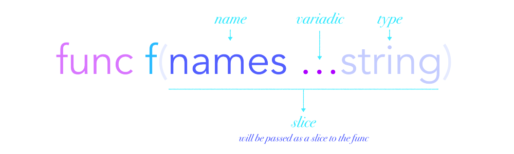
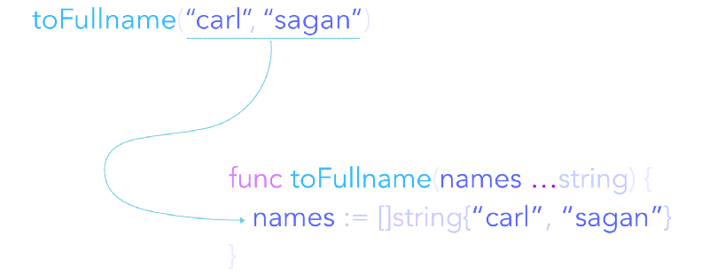
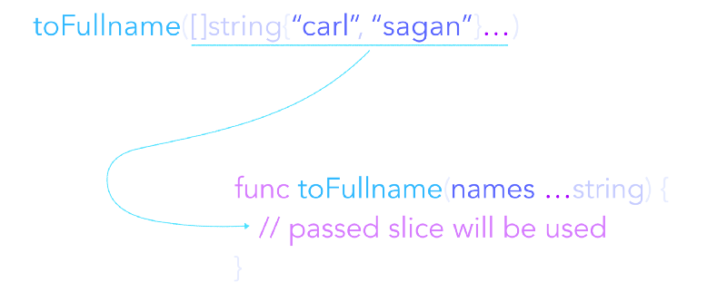
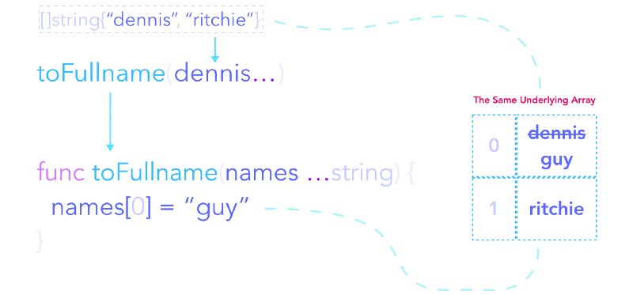

## golang语言规范

### Passing arguments to `...` parameters

https://golang.org/ref/spec#Passing_arguments_to_..._parameters

如果 f 是变数（variadic），其最终参数p的类型为...T，那么在 f 中，p的类型等同于类型 []T。如果调用f时，p没有实际参数，那么传递给p的值就是nil。否则，传递的值是一个类型为 []T 的新的底层数组的分片，其连续的元素是实际的参数，这些参数都必须是可以分配给T的，因此分片的长度和容量是与p绑定的参数数字，对于每个调用点来说可能会有所不同。

给定函数和调用：

```go
func Greeting(prefix string, who ...string)
Greeting("nobody")
Greeting("hello:", "Joe", "Anna", "Eileen")
```

Greeting在第一次调用时的值为nil，第二次调用时的值为 []string{"Joe", "Anna", "Eileen"} 。

如果最后的参数可以分配给一个分片类型 []T，那么如果参数后面有 ...T 参数，它将作为 ...T 参数的值不变地传递。在这种情况下，不会创建新的分片。

给定分片s并调用

```go
s := []string{"James", "Jasmine"}
Greeting("goodbye:", s...)
```

在Greeting，它的值将与s的底层数组相同。

### 摘要：Go 语言“可变参数函数”终极指南

https://studygolang.com/articles/11965

可变参数函数即其参数数量是可变的 —— 0 个或多个。声明可变参数函数的方式是在其参数类型前带上省略符（三个点）前缀。



可变参数的使用场景:

- 避免创建仅作传入参数用的临时切片
- 当参数数量未知
- 传达你希望增加可读性的意图

可变参数函数会在其内部创建一个”新的切片”。事实上，可变参数是一个简化了切片类型参数传入的语法糖。



当不传入参数的时候，可变参数会成为一个空值切片（ `nil` ):


所有的非空切片都有内建的数组，而 nil 切片则没有。

然而，当你向 nil 切片添加元素时，它会自动内建一个包含该元素的数组。这个切片也就再也不是一个 nil 切片了。

可以通过向一个已有的切片添加可变参数运算符 ”…“ 后缀的方式将其传入可变参数函数。

```go
names := []string{"carl", "sagan"}

toFullname(names...)
```

这就好比通常的传参方式：

```go
toFullname("carl", "sagan")
```

**不过，这里还是有一点差异：**函数会在内部直接使用这个传入的切片，并不会创建一个的新的。



可以像下面这样将数组转化成切片后传入可变参数函数：

```go
names := [2]string{"carl", "sagan"}

toFullname(names[:]...)
```

传入的切片和函数内部使用的切片共享同一个底层数组，因此在函数内部改变这个数组的值同样会影响到传入的切片：




### 参考资料

- [Go 语言“可变参数函数”终极指南](https://studygolang.com/articles/11965)：推荐阅读，非常详尽