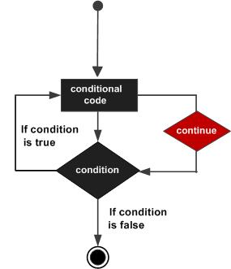

# 跳转语句

## break语句

break语句在循环语句中跳出循环，并开始执行循环之后的语句


```go
i := 0
for { 
    if i >= 3 { break } 
    fmt.Println("Value of i is:", i)
    i++;
}
// break之后，代码从这里继续向后执行
```

break在switch中执行一条case后跳出语句的作用。（TBD：不太理解）

## continue语句

continue语句是跳出当前循环而继续执行下一次循环。



for循环中，执行continue语句会触发for增量语句的执行。

```go
for i := 0; i<7 ; i++ {
    if i%2 == 0 {
        continue 
    }
    fmt.Println("Odd:", i)  
}
```

## label语法

Golang支持label语法，分别是break label、continue label和goto label。

### break lable

break label使用时，label的位置必须在for循环之前，当break生效时，跳出的是label标注的整个for循环。

```go
i := 0
// 注意label必须紧贴着for语句
label1:
for {
    if i >= 3 {
        break label1
    }
    fmt.Println("Value of i is:", i)
    i++;
}
```

leble可以定义多个，break时指定对应的lable，可以做的很灵活：

```go
label1:
for i := 0; i < 10; i++ {
    if i >= 3 {
        break label1
    }

    label2:
    for j := 0; j < 10; j++ {

        if j >= 2 {
            break label2
        }
        fmt.Println("Value of i/j is:", i, j)
    }
}
```

也可以直接在多重循环中间跳出外层循环：

```go
label1:
for i := 0; i < 10; i++ {
    if i >= 3 {
        break label1
    }

    for j := 0; j < 10; j++ {

        if j >= 2 {
            break label1
        }
        fmt.Println("Value of i/j is:", i, j)
    }
}
```

注意：break标签只能用于for循环，不在switch语句中使用，这一点和c，java完全不同，在这些语言中，switch与break是搭档的。

### continue label

continue label跳出当前该次的循环圈，继续循环下一个迭代发生。

```go
label1:
for i := 0; i < 10; i++ {
    if i%2 == 0 {
        continue label1
    }
    fmt.Println("Value of i is:", i)
}
```

同样可以用于多层循环：

```go
label1:
for i := 0; i < 10; i++ {
    if i%2 == 0 {
        continue label1
    }

    label2:
    for j := 0; j < 10; j++ {
        if j % 3 == 0 {
            continue label2
        }
        fmt.Println("Value of i/j is:", i, j)
    }
}
```

## goto语句

goto语句必须配合label使用。


而goto label的label既可以定义在for循环前面，也可以定义在for循环后面。当跳转到标签地方时，继续执行标签下面的代码。确切地说，是调整执行的位置，注意的是标签尽量放在goto后面，避免出现死循环。

```go
for i := 0; i < 10; i++ {
    if i >= 2 {
        goto label1
    }
    fmt.Println("Value of i is:", i)
}

label1:
```

如果写成这样，就会死循环：

```go
label1:
for i := 0; i < 10; i++ {
    if i >= 2 {
        goto label1
    }
    fmt.Println("Value of i is:", i)
}
```

所以如果label写在前面，就要保证后面的循环结构能正确处理。

